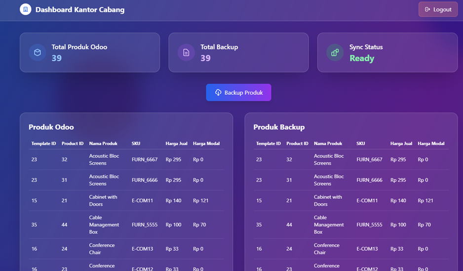

<div align="center">

# Branch Office Web



A simple internal panel to view product data from Odoo (PostgreSQL) and back it up to SQL Server, with basic authentication using Laravel 12.

</div>

## ✨ Features

-   Secure login (database session driver) and logout.
-   Modern dashboard (TailwindCSS) with quick stats.
-   Odoo Products list (template_id, product_id, sale price, cost price, UoM, category, stock, created/updated at).
-   One-click Backup button to copy data from Odoo (PostgreSQL) to the `backup_products` table in SQL Server.
-   Cleans Odoo-specific values (JSON name/UoM/cost) so they persist as plain text/numeric values.

## 🧱 Architecture

-   Backend: Laravel 12 (PHP 8.2)
-   Auth & Session: MySQL (default DB), sessions stored in the `sessions` table
-   Data Source: Odoo on PostgreSQL (`connection: pgsql`)
-   Backup: SQL Server (`connection: sqlsrv`, table: `backup_products`)
-   Frontend tooling: TailwindCSS (UI components via CDN)

Main routes:

-   `GET /login` – login form
-   `POST /login` – process login
-   `POST /logout` – logout
-   `GET /dashboard` – overview and 2 tables: Odoo vs Backup
-   `POST /dashboard/backup` – backup from Odoo to SQL Server

## 🔧 Requirements

-   PHP 8.2+ with extensions: `openssl`, `pdo`, `mbstring`, `tokenizer`, `xml`, `ctype`, `json`
-   Databases:
    -   MySQL (Users + Sessions)
    -   PostgreSQL (Odoo)
    -   SQL Server (backup)
-   PHP DB drivers:
    -   PostgreSQL: `pdo_pgsql`
    -   SQL Server (Windows): Microsoft ODBC Driver + `sqlsrv` and `pdo_sqlsrv` extensions

## 🚀 Setup & Run

1. Install dependencies

```bash
composer install
```

2. Copy env & generate app key

```bash
cp .env.example .env
php artisan key:generate
```

3. Configure database connections in `.env`

Example (see `.env` in the repo for the full set of variables):

```env
# Default (MySQL) for users & sessions
DB_CONNECTION=mysql
DB_HOST=127.0.0.1
DB_PORT=3306
DB_DATABASE=users
DB_USERNAME=root
DB_PASSWORD=******

# Odoo (PostgreSQL)
DB_ODOO_CONNECTION=pgsql
DB_ODOO_HOST=127.0.0.1
DB_ODOO_PORT=5432
DB_ODOO_DATABASE=odoo
DB_ODOO_USERNAME=odoo_user
DB_ODOO_PASSWORD=******

# Backup (SQL Server)
DB_SQLSRV_CONNECTION=sqlsrv
DB_SQLSRV_HOST=127.0.0.1
DB_SQLSRV_PORT=1433
DB_SQLSRV_DATABASE=backup_products
DB_SQLSRV_USERNAME=sa
DB_SQLSRV_PASSWORD=******

SESSION_DRIVER=database
```

4. Run migrations + seed (default MySQL)

```bash
php artisan migrate --seed
```

Seeder creates a default account:

-   Email: `admin@example.com`
-   Password: `11111111`

5. Create the backup table in SQL Server (manual)

Ensure the SQL Server database (`backup_products`) exists, then run this script:

```sql
CREATE TABLE dbo.backup_products (
	template_id   INT            NOT NULL,
	product_id    INT            NOT NULL,
	product_name  NVARCHAR(255)  NULL,
	sku           NVARCHAR(100)  NULL,
	sale_price    DECIMAL(18,2)  NULL,
	cost_price    DECIMAL(18,2)  NULL,
	uom_name      NVARCHAR(100)  NULL,
	category_name NVARCHAR(255)  NULL,
	total_stock   DECIMAL(18,2)  NULL,
	create_date   DATETIME2      NULL,
	write_date    DATETIME2      NULL,
	backup_at     DATETIME2      NULL,
	CONSTRAINT PK_backup_products PRIMARY KEY CLUSTERED (product_id)
);

-- Optional: keep product_id unique
-- CREATE UNIQUE INDEX backup_products_unique_1 ON dbo.backup_products(product_id);
```

6. Start the app

```bash
php artisan serve
```

Open: http://localhost:8000 (or as shown in artisan serve output).

## 🖥️ Usage

1. Log in using the default account above.
2. Go to Dashboard to see the overview plus product tables from Odoo & Backup.
3. Click “Backup Produk” to copy the latest data from Odoo to SQL Server.

Note: The controller already handles Odoo JSON-shaped values (e.g. `{"en_US": "..."}`) so name/UoM/cost are stored cleanly as text/numbers in the backup.

## 🔍 Troubleshooting

-   “Database connection [pgodoo] not configured”: ensure the connection used is `pgsql` (it is in code). Check `DB_ODOO_*` variables in `.env` and ensure `pdo_pgsql` extension is enabled.
-   Date/number conversion error when inserting into SQL Server: ensure column types in `backup_products` follow the script above (`DECIMAL` and `DATETIME2`).
-   Duplicate data (unique constraint): drop the unique index if you want multiple backup histories per `product_id`, or change the `PRIMARY KEY` to a composite `(product_id, backup_at)` to support versions.

## 📦 Stack

-   Laravel 12, PHP 8.2
-   MySQL (auth & sessions), PostgreSQL (Odoo), SQL Server (backup)
